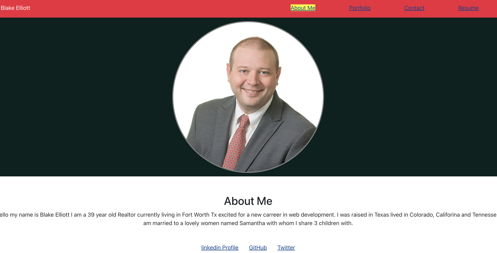

# React Portfolio

## Description:
A react portfolio built for smu coding bootcamp with about me links to my deployed heroku applications and a link to contact me.

## screenshot: 

## GitHub REPO URL:
[Git Repo Link Portfolio](https://github.com/Blaker817/React-Portfolio)

## Deployed link:
[Heroku PWA](https://blake-elliott-pwa-smu.herokuapp.com/)

## Installation:
Clone Repo and run npm install